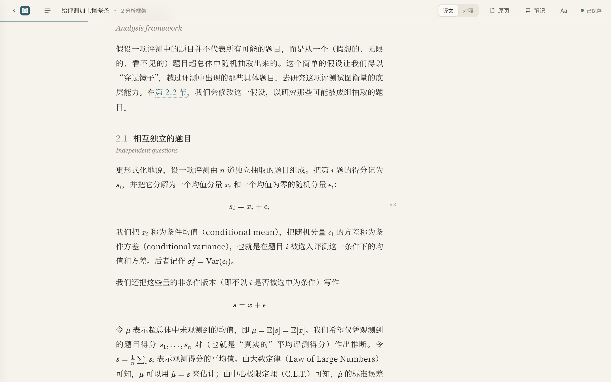
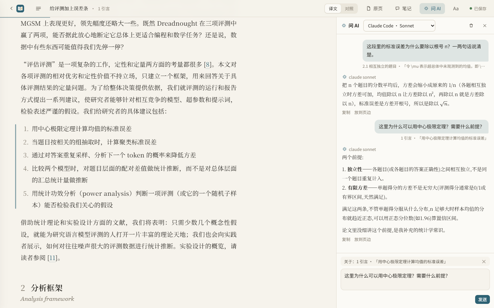
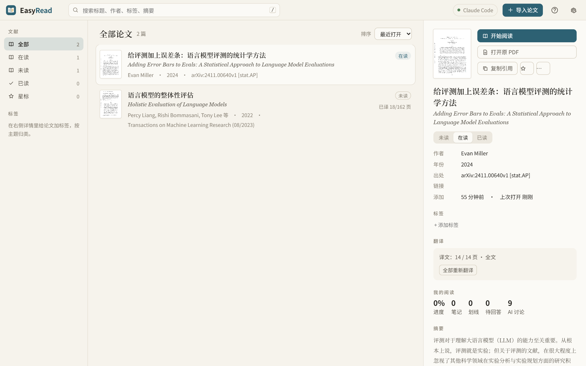
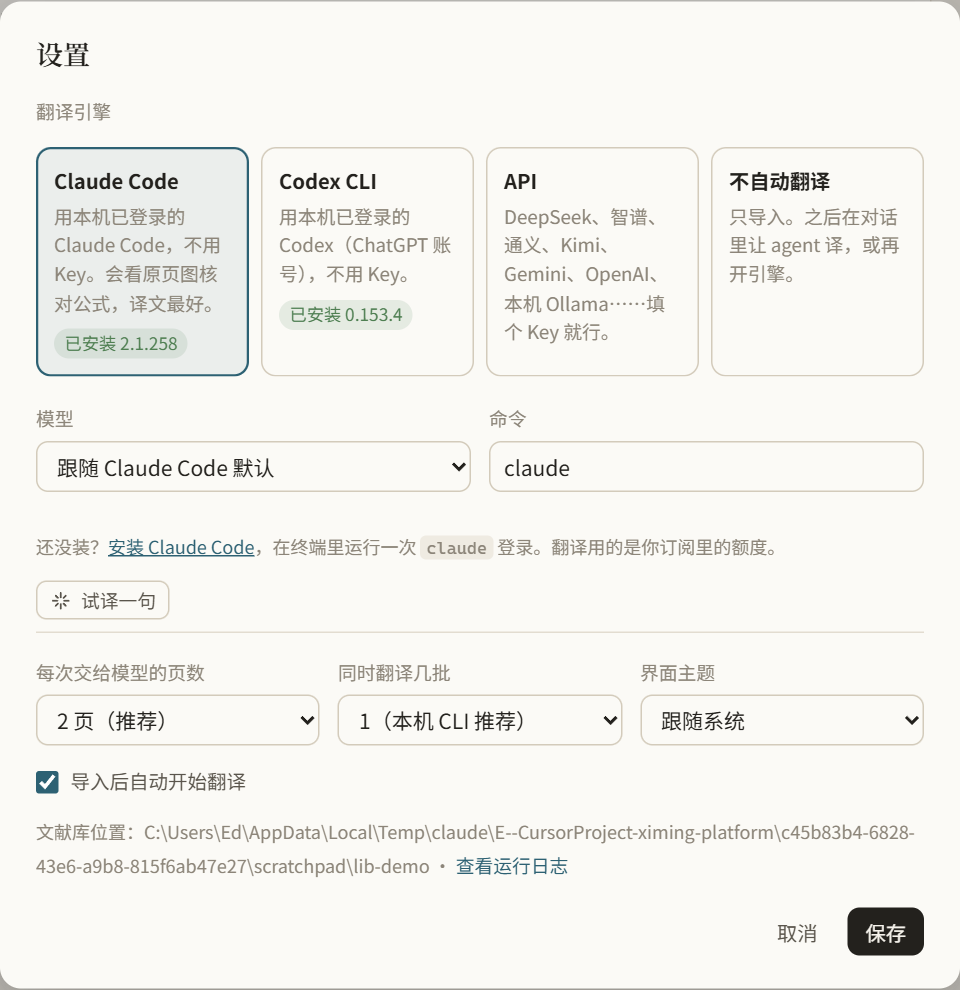

<p align="center">
  
</p>
<h1 align="center">EasyRead</h1>
<p align="center"><b>把英文论文，读成舒服的中文。</b><br>
导入 PDF，后台逐页翻译；公式、表格照原文排好，随时对照原文，边读边划线、记笔记、提问。<br>
本地运行，论文和笔记只存在你自己的电脑上。</p>

<p align="center"></p>

## 它和“把 PDF 丢给翻译软件”有什么不一样

- **像读一本排好版的中文书。** 宋体正文、舒服的行宽和行距，公式用 KaTeX 按原文重排，表格是三线表，参考文献保留原文。
- **随时核对原文。** 一键切“对照”，每段下面附英文；右侧可以开原页，跟着阅读位置翻页，还会框出当前段落在原页的位置。
- **翻译和解释分开。** 正文只放忠实的译文；AI 的解释、回答放在页边，一眼就能分清哪句是论文说的。
- **边读边问 AI。** 右侧“问 AI”面板实时对话，回答逐字流出来；问题自动带上你正在读的段落，选中一句话就只问那句。模型可以单独选：Claude、GPT（Codex）、DeepSeek、通义、本机 Ollama……好的回答一键放到页边。
- **边读边批注。** 选中文字四色划线、写笔记、提问；问题一键让 AI 回答，笔记可以让 AI 点评。所有笔记按原文顺序汇总，可以勾选导出成 Markdown（放进 Obsidian、Notion）。
- **译文可以改。** 双击一段直接改；术语表里改一个译法，全文替换；觉得哪段不好，写上意见让模型重译这一段。
- **不只是 arXiv。** 拖进任何 PDF；或者填 arXiv 编号、DOI、论文标题、论文网页（OpenReview、ACL、NeurIPS、bioRxiv、PMC、期刊页面），自动找到公开的 PDF 并补全作者、年份、出处。
- **文献库。** 搜索、标签、未读 / 在读 / 已读、星标、阅读进度、复制引用（GB/T 7714、APA、BibTeX）、导出单文件离线 HTML 发给别人。快捷键可以自定义。
- **不会丢东西。** 每次修改先存在浏览器，本地服务确认写进文件才删；翻译方后来改了你改过的段落，只提示，不覆盖。

<p align="center"></p>

<p align="center"></p>

## 翻译用什么模型：你来选

| 引擎 | 要什么 | 说明 |
|---|---|---|
| **Claude Code**（推荐） | 装好并登录 [Claude Code](https://docs.claude.com/en/docs/claude-code/setup) | 不用 Key，用你订阅的额度；会自己看原页图核对公式，译文最好 |
| **Codex CLI** | 装好并登录 [Codex](https://github.com/openai/codex) | 不用 Key，用 ChatGPT 账号 |
| **DeepSeek / 通义千问 / Kimi / OpenAI / Anthropic** | API Key | 一篇 20 页论文通常几毛钱到几块钱 |
| **智谱 GLM-4.5-Flash / 硅基流动 / 魔搭 / Groq / Cerebras / GitHub Models / Gemini / OpenRouter** | API Key | 开源模型（Qwen3、GLM、Llama、DeepSeek）免费调用或有免费额度 |
| **Ollama / LM Studio** | 本机装 [Ollama](https://ollama.com) 或 [LM Studio](https://lmstudio.ai) | 完全离线、免费，推荐 qwen3:8b / 14b |
| 不翻译 | — | 只导入，之后让对话里的 agent 译 |

设置里会自动检测本机装了什么，点“试译一句”马上知道能不能用。某一页翻译失败（限流、网络、额度）会自动重试，还不行就先跳过、接着译后面的页，最后一键“重试失败的页”。

<p align="center"></p>

## 安装

需要 [Python 3.10+](https://www.python.org/downloads/)。

**Windows**：下载本仓库，双击 `start.cmd`。第一次会自动装好环境（一分钟左右），之后双击直接打开。

**macOS / Linux**：

```bash
./start.sh
```

**或者用 pip**（数据放在 `~/EasyRead`）：

```bash
pip install git+https://github.com/Edwardxlai/easyread
easyread
```

浏览器会打开 `http://127.0.0.1:8765`。服务只监听本机。

## 怎么用

1. 右上角“设置”选翻译引擎。
2. 把 PDF 拖进窗口；或者粘贴 arXiv 编号、arXiv / OpenReview 链接、PDF 直链（在文献库页面直接 `Ctrl+V` 也行）。长论文可以选“只译正文”或“前几页”。
3. 翻译在后台一页页进行，已译的部分马上能读，没译到的页先显示原页。
4. 读的时候点一下段落出现操作条；选中文字可以划线、写笔记、提问。按 `?` 看全部快捷键。

## 和 AI agent 一起读

EasyRead 自带命令行，Claude Code / Codex 这类 agent 可以在对话里直接读你的笔记和问题、把回答写到对应段落旁边，也可以亲自翻译或重译某几页。技能说明在 [`skill/paper-reading/SKILL.md`](skill/paper-reading/SKILL.md)，把这个目录放进 `~/.claude/skills/` 或 `~/.codex/skills/` 即可。

```bash
easyread list                          # 列出文献库
easyread import 论文.pdf                # 或 arXiv 编号 / 链接
easyread status ID                     # 进度、我改过的译文、笔记、待回答的问题
easyread discuss ID --from 回答.json    # 把讨论写到页边
easyread export ID                     # 导出单文件离线 HTML
```

完整命令见 `easyread --help`，数据格式见 [docs/data-format.md](docs/data-format.md)。

## 常见问题

**翻译到一半失败了？** 文献库里点这篇，右侧“翻译”一栏会写原因和失败的页，点“重试”。“翻译记录”里有每一批的详细情况；设置底部“查看运行日志”能看到服务本身的日志。

**Claude Code 额度用完了？** 等额度恢复后点“重试”，或者在设置里临时换成 API / Ollama，已经译好的页不会重译。

**数据存在哪？** 全在本机。从源码运行时在项目目录的 `library/`；pip 安装后在 `~/EasyRead/library/`。每篇论文一个文件夹，里面是原 PDF、原页图和几个 JSON（译文、你的笔记、AI 讨论、对话记录），设置和界面偏好在 `config.json`、`prefs.json`。可以直接备份或同步。为什么不用数据库见 [docs/data-format.md](docs/data-format.md#为什么用-json-文件而不是数据库)。

**能离线看、发给别人吗？** 文献库里右键 → “导出离线 HTML”，得到一个单文件网页，公式和原页图都在里面。

## 开发

没有前端构建：`easyread/web/` 下是纯 HTML/CSS/JS，改完刷新即可。后端只用 Python 标准库加 PDF 处理库。

```bash
python -m unittest discover tests         # 翻译调度等单元测试
node tests/e2e.cjs                        # 浏览器端到端测试（需要 Playwright）
```

设计取舍见 [docs/design.md](docs/design.md)。

## 许可

MIT。公式渲染用 [KaTeX](https://katex.org)（MIT）。
